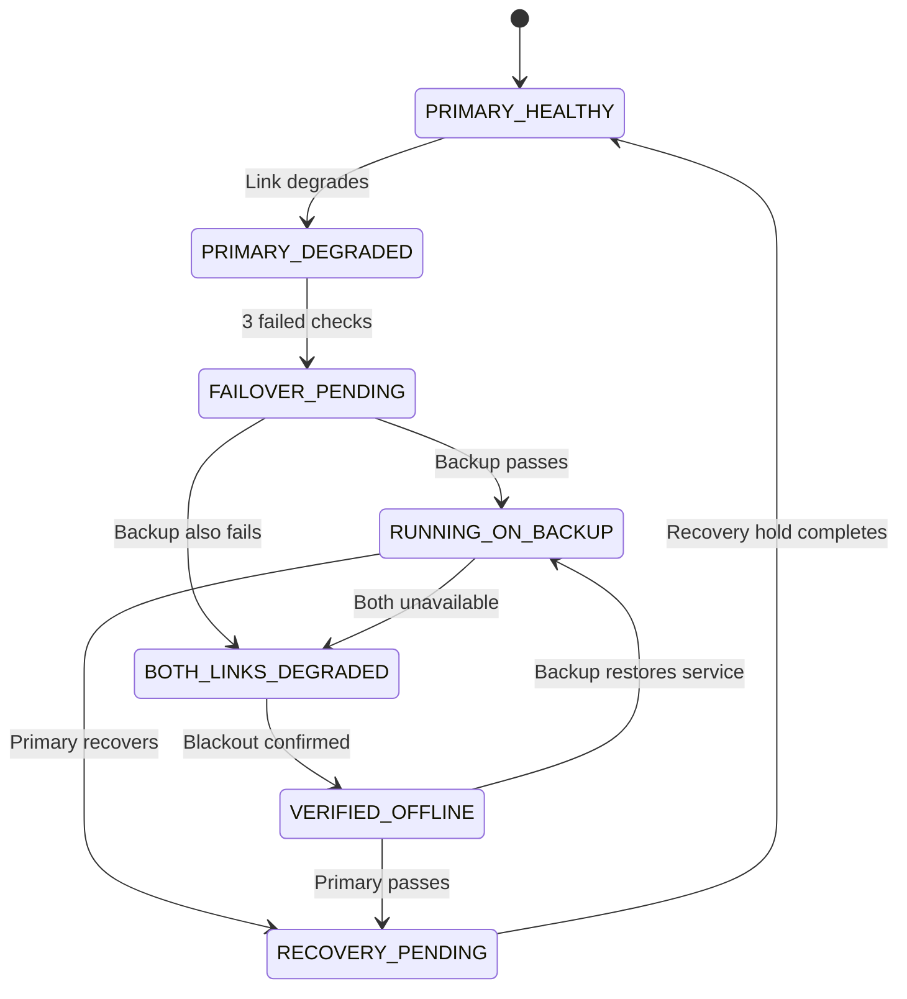

# CellSentry PH

**When one network fails, public service stays online.**

CellSentry PH is a concept-stage connectivity-resilience system for disaster-critical local government sites. It explores how two separately provisioned mobile carrier links, automatic failover logic, readiness monitoring, incident records, and an operator dashboard could help an LGU maintain essential online services when one terrestrial connection becomes degraded or unavailable.

This repository contains the interactive municipal monitoring and failover **simulation** prepared as a proof of concept for the DICT Philippine Startup Challenge.

## Live deployment

**Open the published simulation:** [cellcentry-simulation.vercel.app](https://cellcentry-simulation.vercel.app/)

No installation, build command, local server, account, or login is required for the panel walkthrough. The source is published in this GitHub repository, while the evaluation-ready version is deployed through Vercel.

> [!IMPORTANT]
> This is a non-official, student-built simulation. It is not connected to a live modem, SIM, carrier, tower, PAGASA feed, LGU system, or DICT system. It contains no real outage or emergency-advisory data and does not claim DICT, LGU, or carrier endorsement.

> [!NOTE]
> The project name is styled **CellSentry PH**. The repository URL retains an earlier `cellcentry` spelling.

## Project status

| Area | Current status |
| --- | --- |
| Municipal dashboard | Interactive front-end simulation |
| Failover state machine | Implemented as an in-browser model |
| Weather readiness workflow | Simulated and manually triggered |
| Incident log and report | Generated from the current browser session |
| 3D enclosure | Separate design concept |
| Physical networking device | Not yet built or field-tested |
| Live carrier integration | Not connected |
| Server, database, and authentication | Not implemented in this version |

The simulator is evidence that the proposed workflow, state transitions, operator views, and reporting structure can be demonstrated coherently. It is **not** evidence of real-world switching time, radio performance, battery endurance, cybersecurity, or field reliability.

## Public-service problem

Disaster-response offices, evacuation centers, rural health units, barangay halls, and emergency posts may depend on a single internet path for coordination tools, reports, and online services. If that path fails, personnel may need to diagnose the problem, swap SIMs, restart equipment, or improvise a hotspot while an emergency is already in progress.

CellSentry PH proposes a managed site-level resilience layer that would:

- Monitor a primary and backup terrestrial carrier connection.
- Confirm sustained failure before changing links, reducing rapid link flapping.
- Transfer eligible site traffic to an available backup path.
- Show municipal operators which sites remain connected, degraded, or offline.
- Record readiness checks, transitions, outages, recovery, and operator actions.
- Recommend escalation when neither terrestrial carrier is available.

The concept is intended to **complement**, not replace, radio systems, satellite connectivity, deployable emergency communications assets, backup power, field inspection, or carrier restoration.

## Relevance to communications resilience

The proof of concept concentrates on the site-level gap between normal commercial connectivity and full emergency-communications deployment. Its proposed role is to keep available terrestrial links watched and ready, document what happened, and make the point of escalation visible to municipal operators.

| Resilience need | Demonstrated concept |
| --- | --- |
| Preparedness | Routine monitoring and simulated Weather Alert Mode |
| Redundancy | Primary and backup carrier profiles |
| Continuity | Automatic simulated failover for an eligible critical service |
| Situational awareness | LGU-wide map, site states, health indicators, and heartbeat information |
| Accountability | Structured incident records and after-action reporting |
| Escalation | Recommended radio, satellite, backup-power, or field-response actions after a verified terrestrial blackout |

This is a proposed alignment with public-sector resilience objectives. It is not an assertion of formal adoption, accreditation, partnership, or endorsement.

## What the simulator demonstrates

- Six simulated critical sites in Norzagaray, Bulacan.
- A municipal overview showing healthy, degraded, backup, recovery, and offline states.
- Separate simulated primary and backup carrier profiles.
- Adjustable congestion, failure causes, forced outages, and recovery.
- Three consecutive failed checks before a link is treated as unavailable.
- Three consecutive passing checks plus a recovery hold before a recovered link is trusted.
- A scripted single-site failover demonstration.
- A simulated LGU-wide severe-weather continuity exercise.
- A critical-service continuity panel with simulated requests and switching time.
- Incident filtering, technical detail, acknowledgement, and proposed escalation actions.
- An in-browser after-action report that can be downloaded as a text file.
- Responsive layouts for desktop and smaller displays.

Carrier names shown in the interface identify **simulated profiles only**. They do not represent live carrier measurements, performance comparisons, commercial relationships, or field-test results.

## Viewing the prototype

Open the [live Vercel deployment](https://cellcentry-simulation.vercel.app/) in a modern desktop browser such as Chrome, Edge, or Firefox.

The deployed prototype requires no account or configuration. An internet connection is required to access the deployment and load its embedded geographic reference map. The simulation itself remains a static, single-page front end with no API server, persistent database, or live device connection.

Developers reviewing the source may also open `index.html` directly in a browser. This is optional and is not required for evaluation.

## Suggested panel walkthrough

For a short evaluation session, the following sequence presents the concept clearly:

1. Open the [live simulation](https://cellcentry-simulation.vercel.app/) and point out the prominent simulation notice and LGU-wide status summary on **Home**.
2. Open **LGU Site Overview** to show the six monitored site types, active links, state, simulated UPS charge, AC status, and heartbeat.
3. Scroll to the page footer and open **Developer Options**.
4. Select a critical site and run the **one-minute scripted demo**.
5. Show the primary link being confirmed unavailable only after repeated failed checks.
6. Show the critical service transferring to the backup simulated profile.
7. Open **Incident Log** to show the automatically created sequence of events.
8. Open **Downloadable Report** and generate the simulated after-action report.
9. Return to Developer Options and demonstrate a dual-carrier blackout to show the escalation workflow and the product's limits.

The strongest closing point is that CellSentry PH does not claim to create connectivity when both carriers are unavailable. It instead makes that condition visible and records when another emergency-communications method should be considered.

## Simulation tutorial

### Accessing the hidden Developer Options

The simulation controls are deliberately excluded from the main navigation so the public-facing portal remains focused on monitoring and reporting.

1. Open the [published CellSentry PH portal](https://cellcentry-simulation.vercel.app/).
2. Scroll to the blue footer at the bottom of the page.
3. Locate the underlined **Developer Options** link beneath the simulated compatibility badges.
4. Select the link to open the dark **Tower Congestion Simulator** console.
5. Use **Return to Public Portal** in the upper-right corner to leave the console.

> [!WARNING]
> The hidden footer link is a presentation and interface decision, not an authentication control. Anyone who can load the page can open Developer Options. A future operational implementation would require authenticated users, role-based permissions, audit controls, secure APIs, and server-side validation.

### Tutorial A: Run the scripted failover demonstration

This is the recommended first demonstration because it presents one complete continuity sequence without requiring manual timing.

1. Under **Select Site to Simulate**, choose the desired LGU site.
2. Keep **Fast-Forward Demo (0.5s/tick)** selected for a judging or presentation session.
3. Under **Current Site State**, select **Run One-Minute Scripted Demo**.
4. Follow the progress indicator as the simulator:
   - Establishes a known healthy baseline.
   - Activates simulated Weather Alert Mode.
   - Raises primary-carrier congestion to a severe level.
   - Records three failed primary checks.
   - Enters `FAILOVER_PENDING` while testing the backup profile.
   - Transfers the simulated service to the backup profile.
   - Displays the continuity result.
   - Records the incident and produces an LGU-wide outcome summary.
5. Observe the **Critical Site Service** panel during the sequence. It shows the active link, service status, request counts, interrupted simulated requests, and simulated failover duration.
6. Use **Pause**, **Resume**, **Restart**, or **Skip to Next Stage** when explaining individual transitions.

Expected result: the selected site reaches **Running on backup**, the service remains online in the model, and the transition appears in both the site log and consolidated incident log.

### Tutorial B: Create a manual primary-link outage

1. Select a site and choose a tick speed.
2. In **Tower A: Globe Simulated Profile**, select a failure cause or choose **Simulate Total Outage**.
3. Watch the failed-check counter. The model requires three consecutive failed checks before confirming that the primary profile is down.
4. Observe the site move through degradation and failover-pending states.
5. If Tower B is available, the active link changes to the backup simulated profile.
6. Select **Restore Tower A**.
7. Observe the passing-check counter and recovery hold before the model trusts the primary profile again.

The confirmation thresholds and recovery hold illustrate an anti-flapping design principle. The displayed timing is accelerated simulation time and is not a field-tested performance claim.

### Tutorial C: Demonstrate a verified communications blackout

1. Select **Simulate Total Outage** for both Tower A and Tower B, or choose **Both carriers unavailable** as the failure cause.
2. Allow the required failed checks to complete.
3. Observe the site pass through **Both links degraded** and reach **Verified offline**.
4. Review the red escalation panel.
5. Record simulated operator actions such as:
   - Acknowledge the incident.
   - Assign a field inspection.
   - Recommend a backup-power check.
   - Recommend radio coordination.
   - Recommend satellite deployment.

These buttons only add proposed actions to the in-memory incident record. They do not contact personnel or dispatch equipment.

### Tutorial D: Run the LGU-wide weather exercise

1. Select **Simulate Official Weather-Advisory Trigger** to activate the proposed readiness workflow.
2. Review the Weather Alert Mode summary, including simulated carrier verification, device heartbeats, AC availability, and UPS status.
3. Select **Simulate Typhoon Passing Over LGU (All Sites)**.
4. The simulator assigns different impact profiles across all six sites, including congestion, single-carrier failure, dual-carrier failure, weak links, and a simulated power interruption.
5. Return to the public **Home** page to review the LGU-wide continuity result and updated map.
6. Open **LGU Site Overview** to compare the resulting site states.
7. Use **Clear Typhoon / Reset All Sites** when finished.

The weather trigger is entirely manual. No live PAGASA feed is connected.

### Tutorial E: Review incidents and produce a report

1. Return to the public portal.
2. Open **Incident Log**.
3. Filter the in-memory events by weather readiness, degradation, failover, verified offline, recovery, or operator action.
4. Expand **Technical detail** within an event to review its previous state, new state, recorded action, and acknowledgement status.
5. Open **Downloadable Report**.
6. Select **Generate Latest After-Action Report** to view the current session summary.
7. Select **Download Report (.TXT)** to save the report locally.

Refreshing the browser clears all simulated incidents and returns the model to its initial state.

## State model



The model uses simulated DNS, ping, and HTTPS probe rounds. It does not send real probes to carriers or production services.

## Public portal sections

| Section | Purpose |
| --- | --- |
| Home | LGU-wide counts, schematic site map, continuity result, and simulated advisories |
| LGU Site Overview | Per-site active link, state, health score, simulated UPS charge, AC status, and heartbeat |
| Incident Log | Consolidated event history with filters and technical detail |
| Downloadable Report | In-browser generation and text download of a simulated after-action report |
| About / Disclaimer | Scope, limitations, affiliations, and roadmap boundaries |
| Developer Options | Internal simulation controls, failure injection, scripted demo, and escalation workflow |

## Technical implementation

- Semantic HTML, responsive CSS, and vanilla JavaScript.
- Simulation state stored only in browser memory.
- No framework, package manager, build step, backend, database, cookies, or analytics.
- An embedded Google Maps reference is used only for geographic context.
- Site boxes are positioned from stored coordinates and remain a schematic overlay, not a geodetic monitoring layer.
- HTML output from simulated values is escaped before insertion where applicable.

### Runtime files referenced by the current build

```text
.
├── index.html
└── images/
    └── seal.png      # Optional; a generic simulated fallback appears if unavailable
```

## Current limitations

- All link scores, latency, packet loss, battery levels, heartbeats, requests, transitions, and durations are generated locally.
- The fixed simulated failover duration is not a benchmark or service-level claim.
- The displayed UPS runtime uses a concept-only formula and is not based on hardware testing.
- Different carrier labels do not guarantee independent towers, power, or backhaul.
- No physical router, modem, antenna, SIM, power system, or enclosure is controlled.
- No user authentication, authorization, encryption design, API security, or persistent audit storage is implemented.
- No accessibility, cybersecurity, load, browser-compatibility, or usability certification is claimed.
- No procurement readiness, regulatory approval, radio compliance, or production deployment is claimed.
- The municipal seal and government-portal styling are presentation elements within a clearly labeled simulation.

## Proposed validation priorities

Before any operational claim, the project would need controlled bench testing followed by an authorized, limited field pilot. Priority measurements include:

1. Real failure-detection time across selected carrier links.
2. Time for eligible new traffic to recover on the backup path.
3. Behavior of active sessions when the public IP address changes.
4. Carrier-path diversity at each specific installation site.
5. Battery runtime at a declared critical load.
6. Thermal, electrical, enclosure, and antenna performance.
7. Dashboard security, authentication, authorization, encryption, and audit retention.
8. LGU operator usability, escalation procedures, and training requirements.
9. Performance during congestion, commercial-power interruption, and dual-carrier failure.
10. Clear go, revise, or stop criteria after the pilot.

## Responsible evaluation

Please evaluate this repository as a **concept and interaction prototype**. Its contribution is the proposed operational model: dual-carrier readiness, cautious failover, municipal visibility, incident evidence, and explicit escalation when terrestrial connectivity is no longer available.

It must not be used for real emergency decisions, public advisories, carrier assessment, or dispatch coordination.

## Team

Developed by students from the Far Eastern University Institute of Technology for the DICT Philippine Startup Challenge under the project name **CellSentry PH**.
